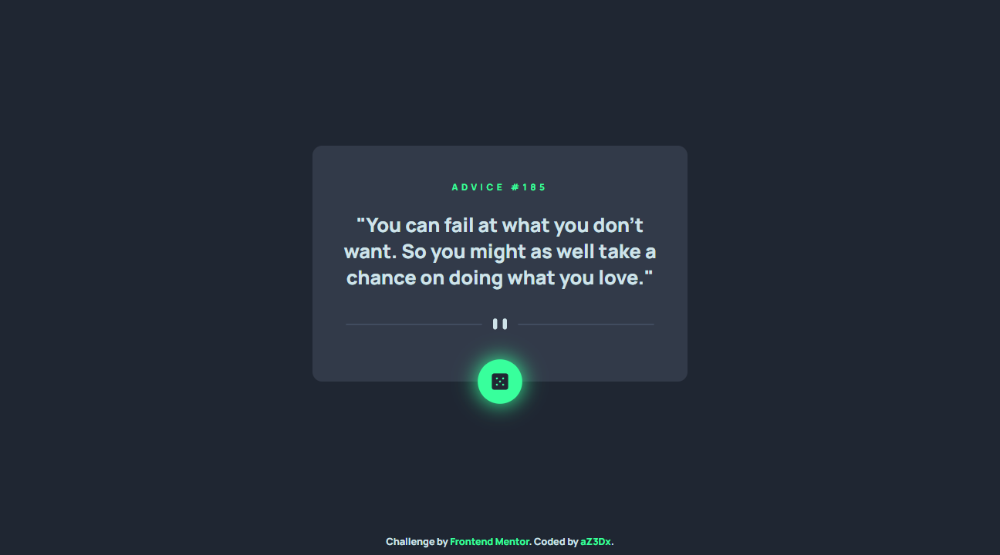
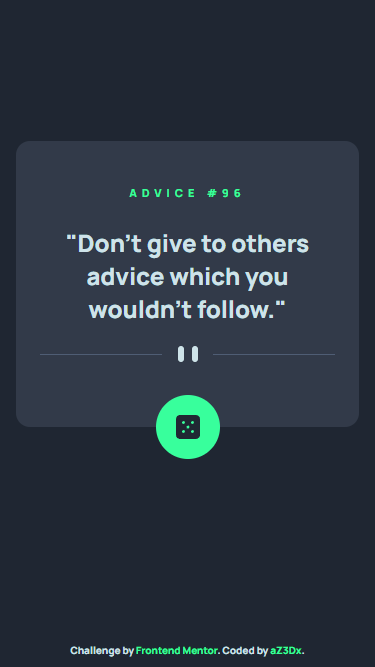

# Frontend Mentor - Advice generator app solution

This is a solution to the [Advice generator app challenge on Frontend Mentor](https://www.frontendmentor.io/challenges/advice-generator-app-QdUG-13db). Frontend Mentor challenges help you improve your coding skills by building realistic projects.

## Table of contents

- [Overview](#overview)
  - [Screenshot](#screenshot)
  - [Links](#links)
- [My process](#my-process)
  - [Built with](#built-with)
- [Author](#author)
- [Acknowledgments](#acknowledgments)

## Overview

### The challenge

Users should be able to:

- View the optimal layout for the app depending on their device's screen size
- See hover states for all interactive elements on the page
- Generate a new piece of advice by clicking the dice icon

### Screenshot

Desktop

Mobile

### Links

- Solution URL: [Here 🐱‍👤](https://github.com/aZ3Dx/advice-generator-app-main)
- Live Site URL: [Here 📟](https://az3dx.github.io/advice-generator-app-main/)

## My process

### Built with

- CSS custom properties
- Flexbox
- Mobile-first workflow
- JS
- [Advice Slip JSON API](https://api.adviceslip.com/)

## Author

- Frontend Mentor - [@aZ3Dx](https://www.frontendmentor.io/profile/aZ3Dx)